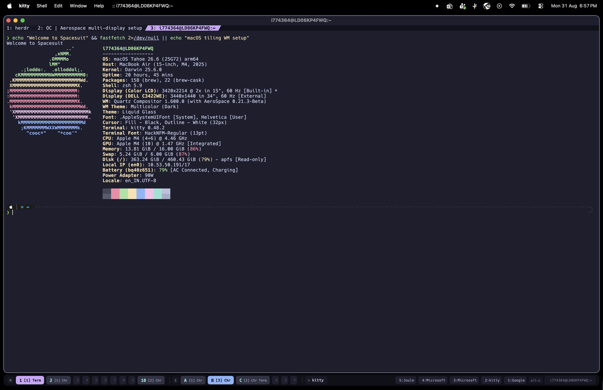
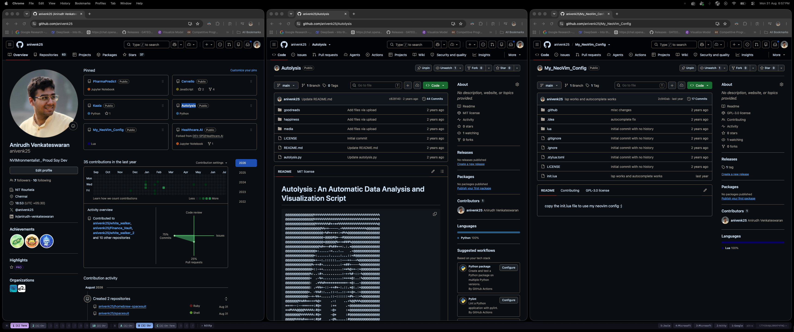
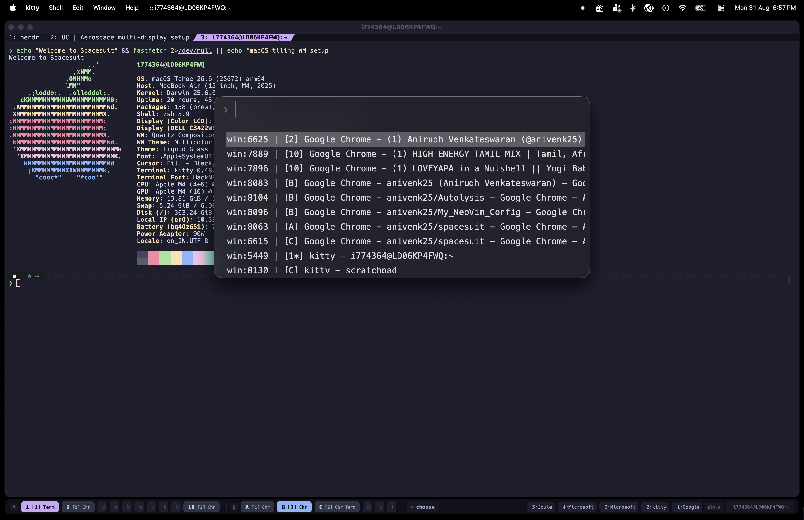
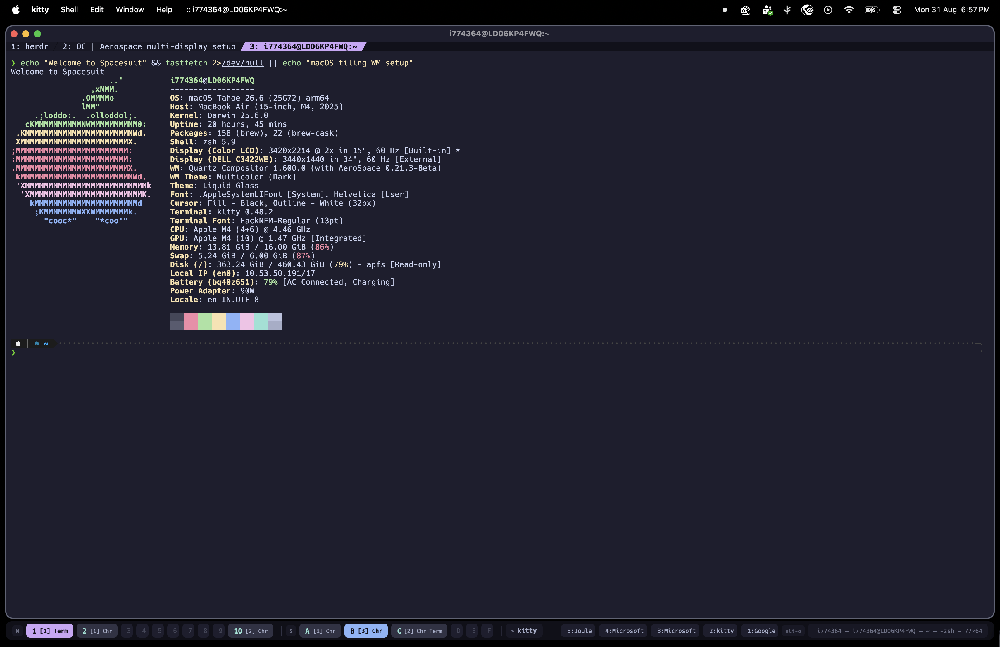
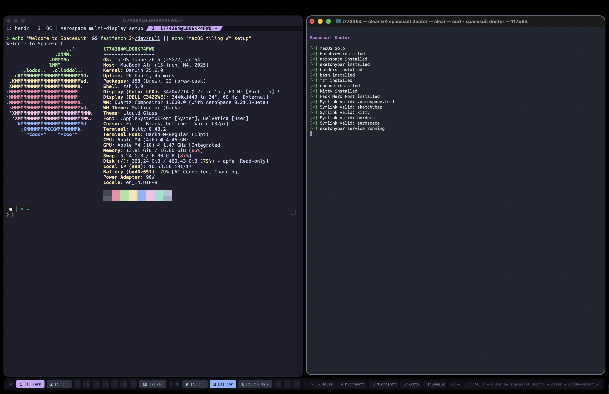
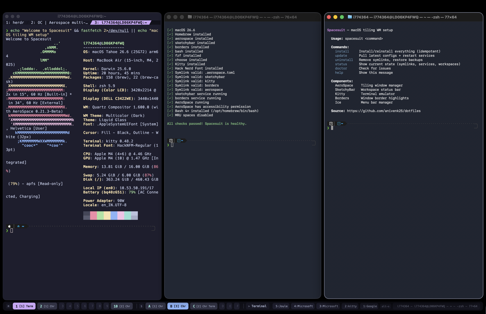

<div align="center">

```
   ____                              _ _
  / ___| _ __   __ _  ___ ___  ___ _   _(_) |_
  \___ \| '_ \ / _` |/ __/ _ \/ __| | | | | __|
   ___) | |_) | (_| | (_|  __/\__ \ |_| | | |_
  |____/| .__/ \__,_|\___\___||___/\__,_|_|\__|
        |_|
```

**Complete macOS tiling window manager setup in one command.**

AeroSpace + SketchyBar + JankyBorders | Catppuccin Mocha

[](https://www.apple.com/macos/)
[](LICENSE)
[](https://github.com/anivenk25/homebrew-spacesuit)

</div>

---

## What is Spacesuit?

Spacesuit turns your Mac into a keyboard-driven tiling window manager setup. One command installs and configures everything — no manual config editing, no hunting for dotfiles.

```bash
curl -fsSL https://raw.githubusercontent.com/anivenk25/spacesuit/main/install.sh | bash
```

That's it. You get:

<table>
<tr>
<td width="50%">

### Tiling Windows
Every window is automatically tiled. No overlapping, no wasted space. Navigate with `alt-hjkl`, move with `alt-shift-hjkl`.

</td>
<td width="50%">

### 16 Workspaces
`1-10` on your main monitor, `A-F` on your secondary. Switch instantly with `alt-<key>`. Works with single or dual monitors.

</td>
</tr>
<tr>
<td width="50%">

### Smart Status Bar
SketchyBar at the bottom shows all workspaces, window counts, app names, and your most-used apps — Catppuccin Mocha themed.

</td>
<td width="50%">

### Window Search
`alt-space` opens a fuzzy finder across all windows, Chrome tabs, and workspaces. Find anything instantly.

</td>
</tr>
</table>

---

### Desktop — Main Monitor



### Desktop — Secondary Monitor



### SketchyBar — Workspace Status


> Purple = focused workspace | Blue = visible on other monitor | Teal = has windows | Dim = empty

### Window Search (`alt-space`)



### Window Borders



### `spacesuit doctor`



### `spacesuit help`



---

## Install

### Option 1: One-liner

```bash
curl -fsSL https://raw.githubusercontent.com/anivenk25/spacesuit/main/install.sh | bash
```

### Option 2: Homebrew

```bash
brew trust anivenk25/spacesuit
brew tap anivenk25/spacesuit
brew install spacesuit
spacesuit install
```

The installer will:
1. Install all dependencies via Homebrew
2. Ask your monitor setup (single / dual / skip)
3. Symlink all configs (with automatic backup of existing ones)
4. Apply macOS settings (dock autohide, menu bar autohide, disable MRU spaces)
5. Start services (SketchyBar, JankyBorders)
6. Open AeroSpace + accessibility settings for you

**Only manual step:** Toggle AeroSpace ON in the accessibility prompt that auto-opens.

---

## Components

| | Component | What it does |
|---|---|---|
| :window: | **[AeroSpace](https://github.com/nikitabobko/AeroSpace)** | i3-like tiling window manager for macOS |
| :computer: | **Terminal.app** | Uses your default macOS terminal — no extra dependency |
| :bar_chart: | **[SketchyBar](https://github.com/FelixKratz/SketchyBar)** | Highly customizable status bar at the bottom |
| :art: | **[JankyBorders](https://github.com/FelixKratz/JankyBorders)** | Subtle colored borders around focused window |
| :mag: | **[choose](https://github.com/chipsenkbeil/choose)** | Native macOS fuzzy picker for window search |
| :shell: | **[Bash 5](https://www.gnu.org/software/bash/)** + **[fzf](https://github.com/junegunn/fzf)** | Modern shell + fuzzy finder for scripts |

---

## Keybinds

### Window Management

| Keybind | Action |
|:---|:---|
| `alt` + `h` `j` `k` `l` | Focus left / down / up / right |
| `alt` + `shift` + `h` `j` `k` `l` | Move window left / down / up / right |
| `alt` + `-` / `=` | Resize smaller / larger |
| `alt` + `/` | Toggle tiles / accordion layout |
| `alt` + `shift` + `g` | Toggle fullscreen |

### Workspaces

| Keybind | Action |
|:---|:---|
| `alt` + `1` ... `9`, `0` | Switch to workspace 1-10 |
| `alt` + `a` ... `f` | Switch to workspace A-F |
| `alt` + `shift` + `1` ... `0`, `a` ... `f` | Move window to workspace |
| `alt` + `tab` | Workspace back-and-forth |

### Multi-Monitor

| Keybind | Action |
|:---|:---|
| `alt` + `` ` `` | Focus next monitor |
| `alt` + `shift` + `` ` `` | Move window to next monitor |
| `alt` + `shift` + `tab` | Move workspace to next monitor |

### Launchers

| Keybind | Action |
|:---|:---|
| `alt` + `enter` | New terminal window |
| `alt` + `space` | Search all windows + Chrome tabs + workspaces |
| `alt` + `s` | Toggle scratchpad (floating terminal) |
| `alt` + `o` then `1`-`5` | Launch top 5 most-used apps (adaptive) |
| `alt` + `o` then `j` | Open GitHub |
| `alt` + `o` then `g` | Open Google |
| `alt` + `o` then `n` | New TextEdit note |

### Service Mode (`alt` + `shift` + `;`)

| Key | Action |
|:---|:---|
| `t` | Force-tile all windows on workspace |
| `f` | Toggle float / tile for focused window |
| `r` | Flatten / reset workspace layout |
| `esc` | Reload config + exit |

---

## Features

### Adaptive Launcher

Spacesuit tracks which apps you use most. Your top 5 apps appear in the status bar and are launchable with `alt-o` then `1-5`. Rankings update automatically as you work.

### Workspace Search

Press `alt-space` to search across:
- All tiled windows (with workspace + app name)
- All Chrome tabs (including background tabs across all windows)
- All workspaces (with window count + app list)

Select any result to instantly focus it — switches workspace and monitor automatically.

### Scratchpad Terminal

`alt-s` toggles a floating terminal that follows you across workspaces. Use it for quick commands without disrupting your tiling layout.

### State Persistence

Window-to-workspace assignments are saved on every workspace switch. If AeroSpace restarts, windows return to their workspaces automatically.

### Status Bar

SketchyBar at the bottom shows:

| State | Appearance |
|:---|:---|
| **Focused workspace** | Purple (Mauve) background |
| **Visible on other monitor** | Blue (Lavender) background |
| **Has windows** | Teal text, window count + app names |
| **Empty** | Dim, barely visible |
| **Front app** | Current focused app name |
| **Window title** | Focused window title (right side) |
| **Top 5 apps** | Most-used apps with `alt-o` hint |

---

## CLI

```
$ spacesuit help

   ____                              _ _
  / ___| _ __   __ _  ___ ___  ___ _   _(_) |_
  \___ \| '_ \ / _` |/ __/ _ \/ __| | | | | __|
   ___) | |_) | (_| | (_|  __/\__ \ |_| | | |_
  |____/| .__/ \__,_|\___\___||___/\__,_|_|\__|
        |_|

  macOS tiling WM setup

  Usage: spacesuit <command>

  Commands:
    install     Install/reinstall everything (idempotent)
    update      Pull latest configs + restart services
    uninstall   Remove symlinks, restore backups
    status      Show current state (symlinks, services, workspaces)
    doctor      Check for issues
    help        Show this message
```

### `spacesuit doctor`

Checks everything is healthy:

```
[✓] macOS 15.1
[✓] Homebrew installed
[✓] aerospace installed
[✓] sketchybar installed
[✓] borders installed
[✓] All symlinks valid
[✓] All services running
[✓] AeroSpace has accessibility permission

All checks passed! Spacesuit is healthy.
```

---

## Theme

**Catppuccin Mocha** across every component:

| Component | Details |
|:---|:---|
| **SketchyBar** | Mantle background, Mauve focused workspace, Teal occupied |
| **Borders** | Subtle lavender active border at 75% opacity |
| **Window gaps** | 10px inner, 10px outer (48px bottom for bar) |

---

## Uninstall

```bash
spacesuit uninstall              # Remove symlinks, restore backups
brew uninstall spacesuit         # Remove formula
brew untap anivenk25/spacesuit   # Remove tap
rm -rf ~/.spacesuit              # Remove source (if curl-installed)
```

Brew packages are kept — remove them individually if desired.

---

## Requirements

- macOS 13 (Ventura) or later
- Apple Silicon or Intel Mac
- Homebrew (installed automatically if missing)

---

## How it works

```
~/.aerospace.toml        → symlink → ~/.spacesuit/.aerospace.toml
~/.config/sketchybar/    → symlink → ~/.spacesuit/.config/sketchybar/
~/.config/borders/       → symlink → ~/.spacesuit/.config/borders/
~/.config/aerospace/     → symlink → ~/.spacesuit/.config/aerospace/
```

All configs are symlinked from `~/.spacesuit` (or brew's libexec). Update the source, configs update everywhere. Existing configs are backed up with `.spacesuit.bak` suffix before being replaced.

---

## Credits

Built with love on top of these excellent projects:

- [AeroSpace](https://github.com/nikitabobko/AeroSpace) by Nikita Bobko
- [SketchyBar](https://github.com/FelixKratz/SketchyBar) by Felix Kratz
- [JankyBorders](https://github.com/FelixKratz/JankyBorders) by Felix Kratz
- [Catppuccin](https://github.com/catppuccin/catppuccin) theme

---

<div align="center">

**[Report an issue](https://github.com/anivenk25/spacesuit/issues)** | **[Homebrew Tap](https://github.com/anivenk25/homebrew-spacesuit)**

</div>
